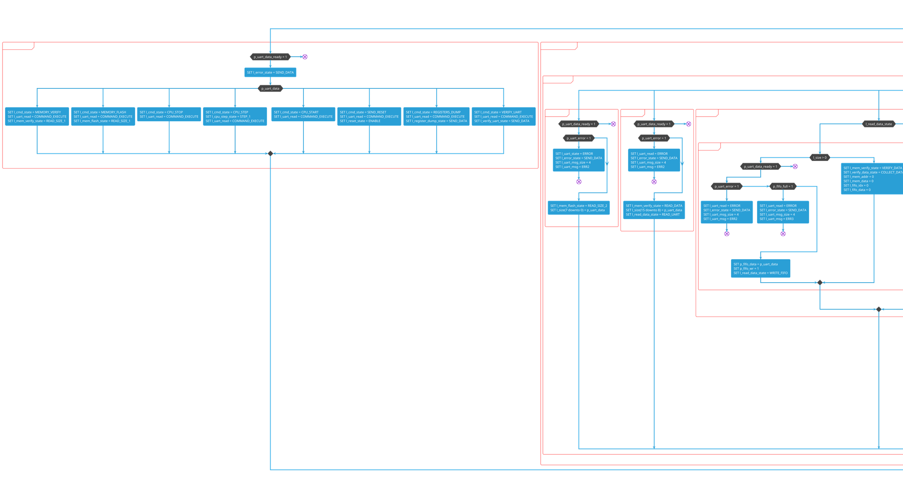

# UART controller hardware description

## Activity diagram:
Whole UART controller activity
--

```plantuml
@startuml
!theme cyborg
skinparam DefaultFontSize 14
skinparam partition {
    FontColor white
    BorderColor red
}

start
:SET l_uart_read = COMMAND_READ;
switch (l_uart_read)
case (COMMAND_READ)
partition "COMMAND_READ" {
  if (p_uart_data_ready = 1) then (true)
    :SET l_error_state = SEND_DATA;
    switch (p_uart_data) 
    case (0)
      :SET l_cmd_state = MEMORY_VERIFY
      SET l_uart_read = COMMAND_EXECUTE
      SET l_mem_verify_state = READ_SIZE_1;
    case (1)
      :SET l_cmd_state = MEMORY_FLASH
      SET l_uart_read = COMMAND_EXECUTE
      SET l_mem_flash_state = READ_SIZE_1;
    case (2)
      :SET l_cmd_state = CPU_STOP
      SET l_uart_read = COMMAND_EXECUTE;
    case (3)
      :SET l_cmd_state = CPU_STEP
      SET l_cpu_step_state = STEP_1
      SET l_uart_read = COMMAND_EXECUTE;
    case (4)
      :SET l_cmd_state = CPU_START
      SET l_uart_read = COMMAND_EXECUTE;
    case (5)
      :SET l_cmd_state = SEND_RESET
      SET l_uart_read = COMMAND_EXECUTE
      SET l_reset_state = ENABLE;
    case (6)
      :SET l_cmd_state = REGISTERS_DUMP
      SET l_uart_read = COMMAND_EXECUTE
      SET l_register_dump_state = SEND_DATA;
    case (7)
      :SET l_cmd_state = VERIFY_UART
      SET l_uart_read = COMMAND_EXECUTE
      SET l_verify_uart_state = SEND_DATA;
    endswitch
  else (false)
    end
  endif
}
case (COMMAND_EXECUTE)
partition "COMMAND_EXECUTE" {
  switch (l_cmd_state)
  case (MEMORY_VERIFY)
  partition "MEMORY_VERIFY" {
    switch (l_mem_verify_state)
    case (READ_SIZE_1)
    partition "READ_SIZE_1" {
      if (p_uart_data_ready = 1) then (true)
        if (p_uart_error = 1) then (true)
          :SET l_uart_state = ERROR
          SET l_error_state = SEND_DATA
          SET l_uart_msg_size = 4
          SET l_uart_msg = ERR2;
          end
      endif
        :SET l_mem_flash_state = READ_SIZE_2
        SET l_size(7 downto 0) = p_uart_data;
      else (false)
        end
      endif
    }
    case (READ_SIZE_2)
    partition "READ_SIZE_2" {
      if (p_uart_data_ready = 1) then (true)
        if (p_uart_error = 1) then (true)
          :SET l_uart_read = ERROR
          SET l_error_state = SEND_DATA
          SET l_uart_msg_size = 4
          SET l_uart_msg = ERR2;
          end
        endif
        :SET l_mem_verify_state = READ_DATA
        SET l_size(15 downto 8) = p_uart_data
        SET l_read_data_state = READ_UART;
      else (false)
        end
      endif
    }
    case (READ_DATA)
    partition "READ_DATA" {
      switch (l_read_data_state)
      case (READ_UART)
      partition "READ_UART" {
        if (l_size > 0) then (true)
          if (p_uart_data_ready = 1) then (true)
            if (p_uart_error = 1) then (true)
              :SET l_uart_read = ERROR
              SET l_error_state = SEND_DATA
              SET l_uart_msg_size = 4
              SET l_uart_msg = ERR2;
              end
            elseif (p_fifo_full = 1) then (true)
              :SET l_uart_read = ERROR
              SET l_error_state = SEND_DATA
              SET l_uart_msg_size = 4
              SET l_uart_msg = ERR3;
              end
            endif
            :SET p_fifo_data = p_uart_data
            SET p_fifo_wr = 1
            SET l_read_data_state = WRITE_FIFO;
          else (false)
            end
          endif
        else (false)
          :SET l_mem_verify_state = VERIFY_DATA
          SET l_verify_data_state = COLLECT_DATA
          SET l_mem_addr = 0
          SET l_mem_data = 0
          SET l_fifo_idx = 0
          SET l_fifo_data = 0;
        endif
      }
      case (WRITE_FIFO)
      partition "WRITE_FIFO                                                                                                                                                         " {
        if (p_fifo_acq = 1) then (true)
          :SET p_fifo_wr = 0
          SET l_size = l_size - 1
          SET l_read_data_state = READ_UART;
        else (false)
          end
        endif
      }
      endswitch
    }
    case (VERIFY_DATA)
    partition "VERIFY_DATA" {
      switch (l_verify_data_state)
      case (COLLECT_DATA)
      partition "COLLECT_DATA" {
        switch (l_memory_data_retrieve_state)
        case (READ_DATA)
        partition "READ_DATA" {
        :SET p_mem_addr = l_mem_addr
        SET p_mem_rd = 1
        SET p_mem_cs = 1;
        if (p_mem_acq = 1) then (true)
          :SET l_mem_data = p_mem_data
          SET l_mem_addr = l_mem_addr + 1
          SET p_mem_rd = 0
          SET l_memory_data_retrieve_state = DATA_READY;
        endif
        }
        case (DATA_READY)
        partition "DATA_READY                                                                                  " {
          :Freeze memory reading until needed;
        }
        endswitch

        switch (l_fifo_data_retrieve_state)
        case (READ_DATA)
        partition "READ_DATA" {
        if (l_fifo_idx < 16 and p_fifo_empty = 0) then (true)
          :SET p_fifo_rd = 1;
          if (p_fifo_acq = 1) then (true)
            :CALL pack_data(l_fifo_data, l_fifo_idx);
          endif
        else (false)
          :SET p_fifo_rd = 0
          SET l_fifo_data_retrieve_state = DATA_READY;
        endif
        }
        case (DATA_READY)
        partition "DATA_READY" {
          :Freeze fifo reading until needed;
        }
        endswitch

        if (l_fifo_data_retrieve_state = DATA_READY and l_memory_data_retrieve_state = DATA_READY) then (true)
          :SET l_verify_data_state = VERIFY_DATA;
        else (false)
          end
        endif
      }

      case (VERIFY_DATA)
      partition "VERIFY_DATA" {
        if (l_fifo_data = l_mem_data) then (true)
          :SET l_fifo_data = 0
          SET l_fifo_idx = 0
          SET l_fifo_data_retrieve_state = READ_DATA
          SET l_memory_data_retrieve_state = READ_DATA;
          if (p_fifo_empty = 0) then (true)
          :SET l_verify_data_state = COLLECT_DATA;
          elseif (p_fifo_empty = 1 and p_uart_busy = 0) then (true)
            :SET l_uart_wr = 1
            SET l_uart_msg = BUNT
            SET l_uart_msg_size = 4
            SET l_mem_verify_state = CLEANUP;
          else (false)
            end
          endif
        else (false)
          :SET l_uart_read = ERROR
          SET l_error_state = SEND_DATA
          SET l_uart_msg_size = 4
          SET l_uart_msg = ERR1;
          end
        endif
      }
      case (CLEANUP)
      partition "CLEANUP" {
        :SET l_uart_wr = 0
        SET l_uart_msg_size = 0
        SET l_uart_msg = 0
        SET l_uart_read = COMMAND_READ
        SET p_mem_cs = 0;
      }
      endswitch
    }
    endswitch
  }
  case (MEMORY_FLASH)
  partition "MEMORY_FLASH" {
    switch (l_mem_flash_state)
    case (READ_SIZE_1)
    partition "READ_SIZE_1" {
      if (p_uart_data_ready = 1) then (true)
        if (p_uart_error = 1) then (true)
          :SET l_uart_read = ERROR
          SET l_error_state = SEND_DATA
          SET l_uart_msg_size = 4
          SET l_uart_msg = ERR2;
          end
        else (false)
          :SET l_mem_flash_state = READ_SIZE_2
          SET l_size(7 downto 0) = p_uart_data;
        endif
      else (false)
        end
      endif
    }
    case (READ_SIZE_2)
    partition "READ_SIZE_2" {
      if (p_uart_data_ready = 1) then (true)
        if (p_uart_error = 1) then (true)
          :SET l_uart_read = ERROR
          SET l_error_state = SEND_DATA
          SET l_uart_msg_size = 4
          SET l_uart_msg = ERR2;
          end
        else (false)
          :SET l_mem_flash_state = READ_DATA
          SET l_size(15 downto 8) = p_uart_data;
        endif
      else (false)
        end
      endif
    }
    case (READ_DATA)
    partition "READ_DATA" {
      switch (l_read_data_state)
      case (READ_UART)
      partition "READ_UART" {
        if (l_size > 0) then (true)
          if (p_uart_data_ready = 1) then (true)
            if (p_uart_error = 1) then (true)
              :SET l_uart_read = ERROR
              SET l_error_state = SEND_DATA
              SET l_uart_msg_size = 4
              SET l_uart_msg = ERR2;
              end
            elseif (p_fifo_full = 1) then (true)
              :SET l_uart_read = ERROR
              SET l_error_state = SEND_DATA
              SET l_uart_msg_size = 4
              SET l_uart_msg = ERR3;
              end
            endif
            :SET p_fifo_data = p_uart_data
            SET p_fifo_wr = 1
            SET l_read_data_state = WRITE_FIFO;
          else (false)
            end
          endif
        else (false)
          :SET l_mem_flash_state = FLASH_MEMORY
          SET l_mem_addr = 0
          SET l_package_index = 0
          SET l_data_package = 0;
        endif
      }
      case (WRITE_FIFO)
      partition "WRITE_FIFO                                                                                                                                                         " {
        if (p_fifo_acq = 1) then (true)
          :SET p_fifo_wr = 0
          SET l_size = l_size - 1
          SET l_read_data_state = READ_UART;
        else (false)
          end
        endif
      }
      endswitch
    }
    case (FLASH_MEMORY)
    partition "FLASH_MEMORY" {
      switch (l_flash_memory_state)
      case (READ_DATA)
      partition "READ_DATA" {
        if (p_fifo_empty = 0 and l_package_index < 16) then (true)
          :SET p_fifo_rd = 1;
          if (p_fifo_acq = 1) then (true)
            :CALL pack_data(l_data_package, l_package_index);
          else (false)
            end
          endif
        else (false)
          :SET l_flash_memory_state = FLASH_MEMORY
          SET p_fifo_rd = 0;
        endif
      }
      case (FLASH_MEMORY)
      partition "FLASH_MEMORY" {
        if (p_mem_acq = 1) then (true)
          :SET l_mem_addr = l_mem_addr + 1
          SET p_mem_wr = 0
          SET l_data_package = 0;
          if (p_fifo_empty = 0) then (true)
            :SET l_flash_memory_state = READ_DATA;
          elseif (p_fifo_empty = 1 and p_uart_busy = 0) then (true)
            :SET l_uart_wr = 1
            SET p_mem_cs = 1
            SET l_uart_msg = BUNT
            SET l_uart_msg_size = 4
            SET l_flash_memory_state = CLEANUP;
          else
            end
          endif
        else (false)
          :SET p_mem_addr = l_mem_addr
          SET p_mem_wr = 1
          SET p_mem_data = l_data_package;
        endif
      }
      case (CLEANUP)
      partition "CLEANUP" {
        :SET l_uart_wr = 0
        SET l_uart_msg_size = 0
        SET l_uart_msg = 0
        SET l_uart_read = COMMAND_READ
        SET p_mem_cs = 0;
      }
      endswitch
    }
    endswitch
  }
  case (CPU_STOP)
  partition "CPU_STOP" {
  :SET p_clk_gating = 1
  SET l_uart_read = COMMAND_READ;
  }
  case (CPU_STEP)
  partition "CPU_STEP" {
    switch (l_cpu_step_state)
    case (STEP_1)
    partition "STEP_1" {
      if (cpu_clock = 0 and clk_gating = 1) then (true)
        :SET p_clk_gating = 0
        SET l_cpu_step_state = STEP_2;
      else (false)
        end
      endif
    }
    case (STEP_2)
    partition "STEP_2" {
      if (p_cpu_clk = 1) then (true)
        :SET p_clk_gating = 1
        SET l_uart_read = COMMAND_READ;
      else (false)
        end
      endif
    }
    endswitch
  }
  case (CPU_START)
  partition "CPU_START" {
    :SET p_clk_gating = 0
    SET l_uart_read = COMMAND_READ;
  }
  case (SEND_RESET)
  partition "SEND_RESET" {
    switch (l_reset_state)
    case (ENABLE)
    partition "ENABLE" {
      :SET p_reset = 1
      SET l_reset_state = DISABLE;
    }
    case (DISABLE)
    partition "DISABLE" {
      :SET p_reset = 0
      SET l_uart_read = COMMAND_READ;
    }
    endswitch
  }
  case (REGISTERS_DUMP)
  partition "REGISTERS_DUMP" {
    switch (l_register_dump_state)
    case (SEND_DATA)
    partition "SEND_DATA" {
      if (p_uart_busy = 0) then (true)
        :SET l_uart_wr = 1
        SET l_uart_msg = p_register_dump
        SET l_uart_msg_size = 31 * 4
        SET l_register_dump_state = CLEANUP;
      else (false)
        end
      endif
    }
    case (CLEANUP)
    partition "CLEANUP" {
      :SET l_uart_wr = 0
      SET l_uart_msg_size = 0
      SET l_uart_msg = 0
      SET l_uart_read = COMMAND_READ;
    }
    endswitch
  }
  case (VERIFY_UART)
  partition "VERIFY_UART" {
    switch (l_verify_uart_state)
    case (SEND_DATA)
    partition "SEND_DATA" {
      if (p_uart_busy = 0) then (true)
        :SET l_uart_wr = 1
        SET l_uart_msg_size = 12
        SET l_uart_msg = verification
        SET l_verify_uart_state = CLEANUP;
      else (false)
        end
      endif
    }
    case (CLEANUP)
    partition "CLEANUP" {
      :SET l_uart_wr = 0
      SET l_uart_msg_size = 0
      SET l_uart_msg = 0
      SET l_uart_read = COMMAND_READ;
    }
    endswitch
  }
  endswitch
}
case (ERROR)
partition "ERROR" {
  switch (l_error_state)
  case (SEND_DATA)
  partition "SEND_DATA" {
    if (p_fifo_empty = 0) then (true)
      :SET p_fifo_reset = 1;
    endif
    if (p_uart_busy = 0) then (true)
      :SET l_uart_wr = 1
      SET l_error_state = CLEANUP;
    else (false)
      end
    endif
  }
  case (CLEANUP)
  partition "CLEANUP" {
    :SET l_uart_wr = 0
    SET p_fifo_reset = 0
    SET l_uart_msg_size = 0
    SET l_uart_msg = 0
    SET l_uart_read = COMMAND_READ;
  }
  endswitch
}
endswitch
end
@enduml
```
